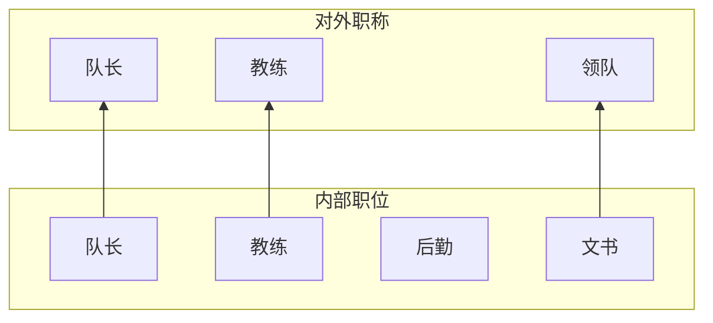

- 开始日期：2024-10-27
- RFC PR：[RuanJianZongHeng/rfcs#0002](https://github.com/RuanJianZongHeng/rfcs/pull/0002)

# 总结
此 RFC 描述了辩论队的结构。重新确立职位以及各职位的职责。

# 动机

现实的目的就是提高工作效率，降低工作压力。

而从更高层面来讲，辩论人前行的理由，是其内心建构起来的自己所坚信的「价值」。但「价值」，往往又是脆弱的。一段无谓的争吵、无礼的戏谑、无情的指责，一堆乱如麻的繁杂事务，得不到的认同，被否定的使命，无处的归属，都足以击碎「价值」。

对抗「混乱」唯有「秩序」，对抗「解构」唯有「建构」，对抗「虚无」唯有「价值」。

如何在队伍之中建构起足以支撑大家的群体的价值与坚信，如何避免高压、混乱对价值、热爱的磨损，是一个队长永恒的课题。

当他捧着星，众人将其拥簇，彼此的火成为彼此的光，彼此的羁绊成为稳固的锁链，当苦成为甘饴，险阻成为理想的色彩，不再会有任何人或事可以阻挡这个队伍前行。

## 试图解决的问题

### 职位职责不明晰

每当涉及不同职位有什么区别时，我 [AzurIce (AzurIce)](https://github.com/AzurIce)，从学长嘴里听到最多的话就是“其实区别不大”。“不是说所有人承担了某一个职位，就只做某些事情”，这句话看上去十分“理想”，但是如今已成为了每个人镜片上的一层“每一个人都要做所有事情”的朦胧。

或许，在每一个具体的活动中，合理的分配且明晰“谁应当干什么”这件事是队长的使命，但是各个“职位”应当有其意义，而非只是一个“名称”。

要不然，还要其他职位干什么，不如只留一个职位，名曰“队长”？

### 工作压力过大

仅仅是带比赛，就足以占据一个人的绝大部分时间，消耗绝大部分精力。

更何况，目前，带比赛、办比赛的人是同一群人。

没有什么热爱能够抵挡无止境的高压，就连我 [AzurIce (AzurIce)](https://github.com/AzurIce) 也不行。

更何况，在这之上，又有指责，又有质疑。

归属、认同、使命，就是在这一次一次的磨损中崩塌。

「解构」，永远比「建构」简单；「放弃」，永远比「坚持」简单。

没有仍存「热爱」的辩手的辩论队，毫无意义。

# 内容

## 每届队伍规模及职位分配

理想情况下辩论队每届队员数量至少应满足 10 人，近几年每届队员数量如下：

- 21 级：9 人
- 22 级：12 人
- 23 级：11 人

10 人队伍能够重组满足下述的结构需求。

与以往的经典 **队长**、**教练**、**领队** 的职称安排不同，每一届的每一个队员都具有一个内部的「**职位**」，不同的「**职位**」具有不同的职能，部分「**职位**」同时具有对外的「**职称**」：

内部的四个「**职位**」分配及其职能如下（只简单列出了可能负责的工作内容，具体工作内容应当对于每一个具体活动由一个详细的 RFC 确定）：

- **队长（1 位）**：能够带领整个队伍面对问题、解决问题，能够守护大家对辩论的「热爱」，并凝聚起整个队伍一同前行的人。

- **教练（^ 6 位）**：对辩论有极深的热情，能够带领大家钻研如何积累技术、打好辩论，以及如何将这些传递给下一届，如何为辩论队积淀辩论财富。

    大致工作内容：带比赛、准备培训内容、准备表演赛、出席评委，等等与「辩论」本身密切相关的内容。

- **后勤（^ 2 位）**：能够从容处理各项细碎小事，为辩论队提供强力后勤支持。

    大致工作内容：打印各种草稿纸评审表、买水买笔、跑打印店、跑场地等等后勤支持工作。

- **文书（^ 1 位）**：有一定的审美素养，同时熟练各种基本软件的使用（Office、在线文档等等），善于文档记录。同时，**文书兼任领队**，负责与外院联络。

    大致工作内容：整理辩论队文件、报名表修改、会议记录、日常记录、请评委嘉宾等等。

也就是说，除队长指定为一个人外，所有队员均应从 **教练**、**后勤**、**文书** 之中选择适合自己的一个职位，具体的选拔与最终的决定方式仍需要一个具体的 RFC。

## 有关队长

只有队伍的 **队长** 有 **权利** 管理或赋权其他人管理辩论队，当队长卸任时其赋予的权力均被收回。

任何其他人不能以一己之言左右 **队长** 的决定，包括任何“高资历”辩手。大家之所以选择了他作为 **队长**，就是选择了 **相信** 他。

**但是，不代表队长可以随意左右整个辩论队。队长为队伍找寻方向，凝聚、团结这群志同道合者，是领头羊，而非掌权人。整个辩论队的权力，永远都在每一位队员手中。**

所以，还是那句话：

「如果你觉得你是对的，那就站上来讲一段」

只要大一、大二、大三、大四全体队员中超过半数的人不赞成 **队长** 的某一决定，那么这个决定便不具有效力，因为 **找到一条大家共同相信、认同的道路，并带领着大家前进** 是队长的 **责任**，回应众人的相信与期待是队长的 **义务**。

所以，如果你觉得 **队长** 哪里有问题，你该做的不是强调自己的资历，而是去用你的表达，去说服你的队友们。

**权利** 与 **义务**。

## 工作模式

每年的全部工作，由两个年级的队员一同承担。同时每一个职位由高年级与低年级一对一形成一组 **绑定关系**：

- **队长**：高年级为 **队长**，低年级为 **副队长**。

- **教练**：高年级为 **教练**，低年级为 **实习教练**。

    **对于带比赛任务**：

    一个年级六个教练，两个年级十二个教练，即便对于强度最高的第一轮新生赛，六个班级十二支队伍，令每一组教练负责一组相反持方，人员也是充足的，且同一组可以自行安排轮换，**工作量减半**。经过一轮后，后续带比赛强度也会更低，而至于在淘汰后的带比赛工作应如何分配，需要另一个 RFC 来确定，这里简单阐述一种在这个结构下的下的可行方案：

    - 一组教练共同承担相同的带比赛任务

    - 备赛开始日与结束日二人均应到场

    - 备赛中间二人可自行讨论安排轮换带比赛

        比如，高年级对比赛实际操作经验较多，或许前面几天会先等论出来，后面几天打磨环节。

        又或者，开始两人一同确定论，之后实习教练带着准备环节，准备好后由高年级负责打磨

        根据时间问题、辩论技能倾向，都可以做很灵活的安排，二人自行安排。

    - ......

    **对于其他任务**：

    在设想中，这一群教练应该形成一个有机整体，致力于提高辩论队辩论水准，为辩论队积累辩论财富（比如一些总结、经验、笔记、复盘等），可能会利用起 [RuanJianZongHeng/RuanJianZongHeng.github.io](https://github.com/RuanJianZongHeng/RuanJianZongHeng.github.io) 这个平台。或许会使“培训”不仅仅停留于一培、二培这两个名字，自发讨论组织一些环节培训或是分析复盘。

    简单来说就是，是一群对辩论本身具有热爱，会想方设法如何把辩论打好，如何精进一步，如何把这些带给大家，如何让大家打辩论打得更好的一群人。

- **后勤**、**文书**：同样，低年级为 **实习**。

    这种结组的结构对于这类工作无疑是无比适用的，因为这类工作往往就是第一次做得时候并不熟悉，而做几次才会熟悉。高年级简简单单空口讲几句，指点指点并不会有效的让没有经验的新生凭空获得一年的经验，只有带着真正参与进去，走那么一遭，才真正的知道一切是怎么回事。

## 各种活动的工作安排

对于不同的活动，整体的工作强度以及任务种类不同，因此需要具体讨论，可能对于具体的每一个活动都需要确定一个 RFC 来确定可行的执行方案与指导思想。

整个一年经历的全部活动大致如下，加粗的为 **十分** 需要一个单独的 RFC 进行讨论具体安排、分配、执行方案的：

- **一培**
- **院新生赛**
- **院队报名 & 面试**
- **二培**
- 校新生赛
- 校队报名 & 一面、二面
- 交大论坛
- 院队换届
- 贝系列赛

# 实现方式

此 RFC 只是为辩论队结构提出了一个设想/纲领性质的方案，具体的实施方式，详细到招新、面试、换届的每一个环节都需要新的 RFC 进行细化。但是这个结构不会改变。

# 问题

仍需 RFC 细化设计辩论队结构相关更迭运转的方案，如招新、面试、换届，以及这些职位在实际的各个具体活动中如何发挥作用。